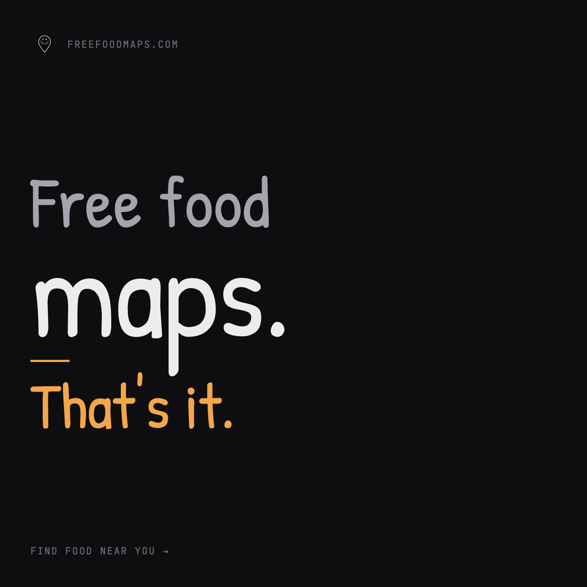
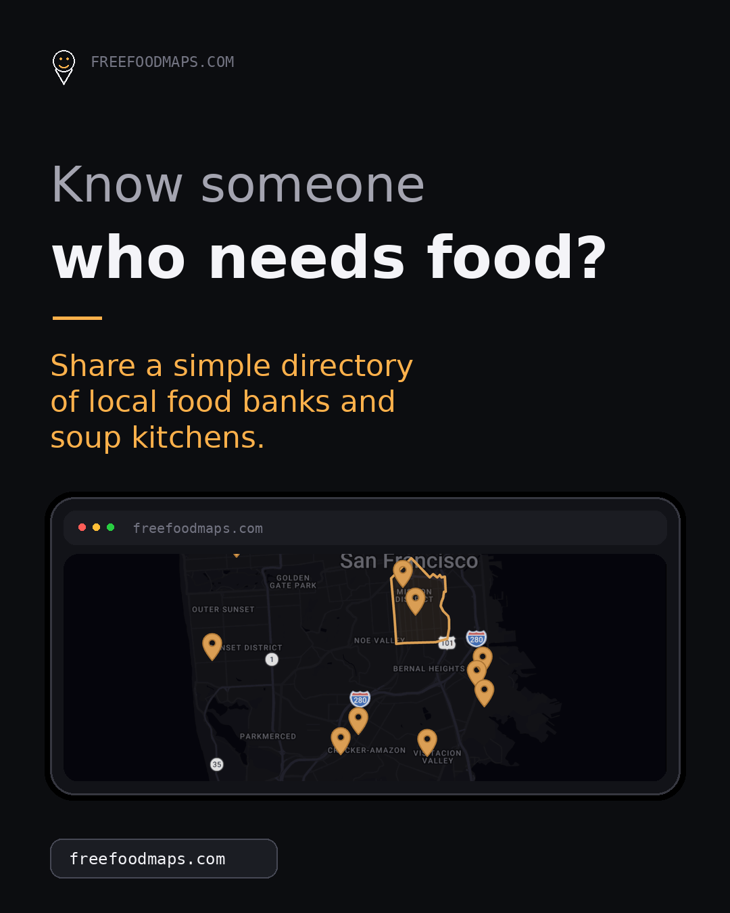
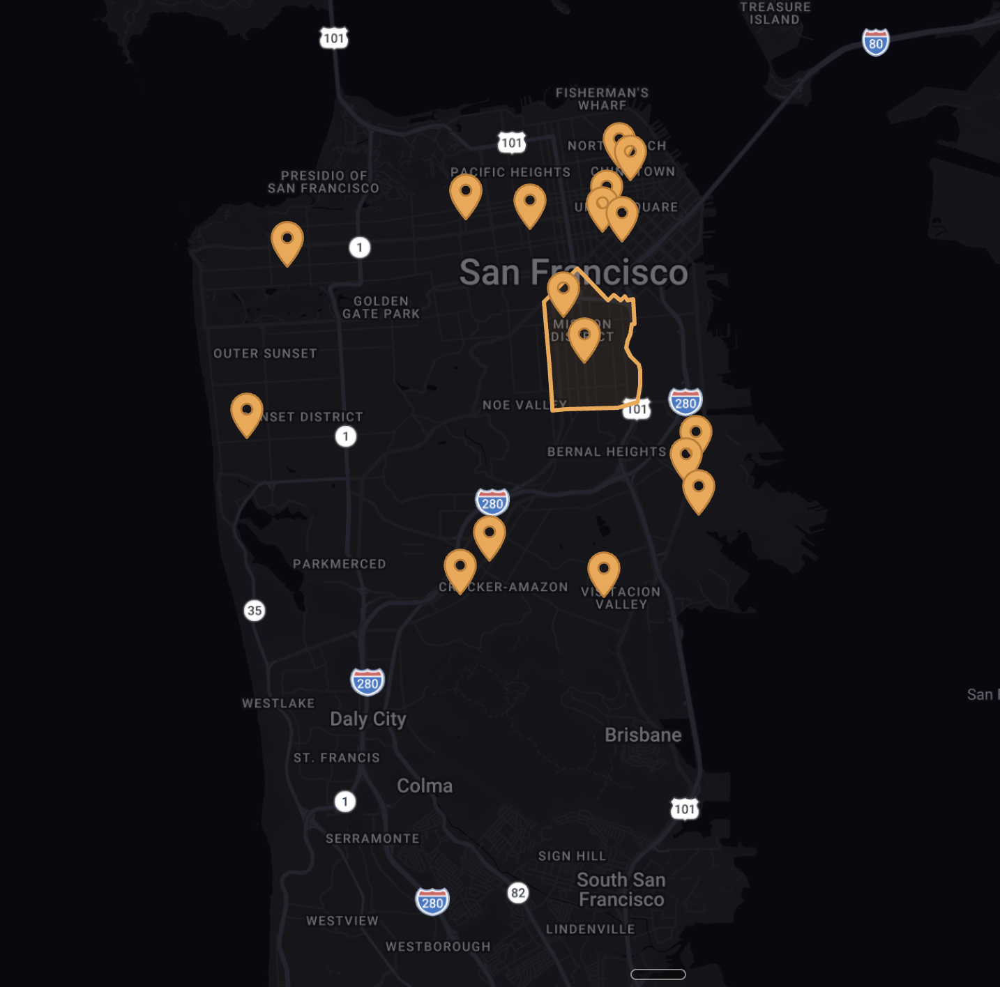
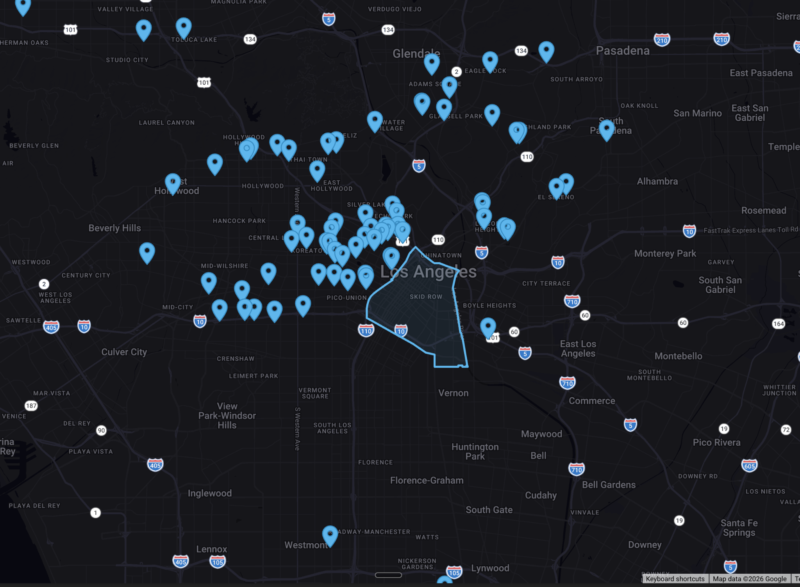

<div align="center">
  
  <br /><br />
  <p><strong>Find free food near you — no ID, no questions, no barriers.</strong></p>
  <p>
    <a href="https://freefoodmaps.com">freefoodmaps.com</a> &nbsp;·&nbsp;
    San Francisco &nbsp;·&nbsp; Los Angeles
  </p>
  <br />
  
</div>

---

## What it does

Free Food Maps is an open directory of food banks, soup kitchens, community pantries, and free meal programs across San Francisco and Los Angeles. Every pin on the map is a real place you can walk into today.

- **No ID required** — every listed location is accessible without documentation
- **No questions asked** — we only list walk-in programs, no intake barriers
- **Updated weekly** — pulled from local food bank networks and community sources
- **Community notes** — anyone can leave tips on a location and vote helpful ones up

---

## Cities

<table>
  <tr>
    <td align="center">
      <br />
      <strong>San Francisco</strong><br />
      <a href="https://freefoodmaps.com">freefoodmaps.com</a>
    </td>
    <td align="center">
      <br />
      <strong>Los Angeles</strong><br />
      <a href="https://freefoodmaps.com">freefoodmaps.com</a>
    </td>
  </tr>
</table>

---

## Stack

| Layer | Tech |
|---|---|
| Framework | Next.js 14 (App Router) |
| Language | TypeScript |
| Map | Google Maps JavaScript API |
| Database | Supabase (Postgres + RLS) |
| Hosting | Vercel |
| Analytics | Vercel Analytics + Meta Pixel |
| Email | Resend |

---

## Local development

```bash
cp .env.example .env.local   # fill in your keys
npm install
npm run dev
```

Open `http://localhost:3000`.

### Environment variables

| Variable | Purpose |
|---|---|
| `NEXT_PUBLIC_GOOGLE_MAPS_API_KEY` | Google Maps JS API key |
| `NEXT_PUBLIC_SUPABASE_URL` | Supabase project URL |
| `NEXT_PUBLIC_SUPABASE_ANON_KEY` | Supabase anon key |
| `SUPABASE_SERVICE_ROLE_KEY` | Service role key (scraper + admin writes) |
| `HMAC_SECRET` | IP rate-limit hashing for community comments |
| `RESEND_API_KEY` | Email alerts for flagged comments |
| `ADMIN_EMAIL` | Where flag alerts are sent |

---

## Database setup

The repo includes migrations and a seed file under `supabase/`.

```bash
supabase login
supabase link --project-ref <your-project-ref>
supabase db push          # applies migrations
```

For local Docker development:

```bash
supabase start
supabase db reset         # applies migrations + seed data
```

---

## Scraper

An automated agent ("Jeremey") keeps listings current. The scraper lives in `scraper/` and targets the SF-Marin Food Bank locator.

```bash
cd scraper
npm run scrape
```

- Scrapes structured pantry fields
- Writes local JSON snapshots to `scraper/data/`
- Upserts rows into `public.locations` when Supabase env vars are set
- Stores raw payloads in `public.location_snapshots`

---

## Contributing

Spotted a wrong address or a missing location? Email **malcolm.e.mcdonald@gmail.com** or use the Community Notes button on any map pin.

Pull requests welcome.
